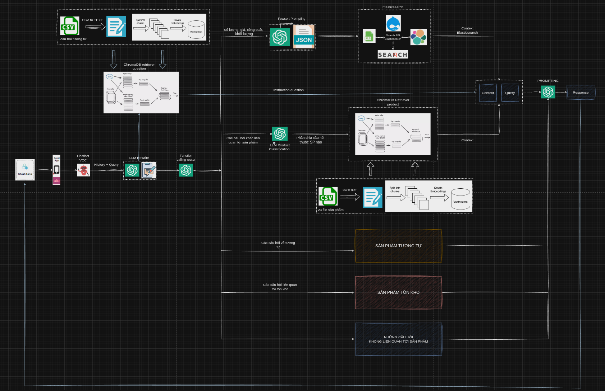

<div align="center">

# SALES ARMY CHATBOT


[](https://github.com/PhamTrinhDuc/Chatbot_ver11/stargazers)[](https://github.com/PhamTrinhDuc/Chatbot_ver11/issues)


Chatbot sales army is a chatbot product aimed at selling and consulting products by interacting directly with customers. Chatbot uses RAG techniques - an advanced artificial intelligence solution that combines the ability to retrieve accurate information and the ability to generate natural answers.

</div>

## **1. Pipeline**

<div align="center">

</div>

## **2. Tree Project**
    ├── app.py                              # demo on gradio app
    ├── configs
    │   ├── config_fewshot                  # config cho elastic search và các ví dụ fewshot
    │   │   ├── enum.py
    │   │   ├── example_fewshot.yml
    │   ├── config.yml
    │   ├── __init__.py
    │   ├── load_config.py
    ├── data
    │   ├── Cau_hoi_thuong_gap.csv          # file chứa các câu hỏi thường gặp của khách hàng
    │   ├── dieu_hoa.csv                    # file sản phẩm điều hòa
    │   ├── product_final_300_extract.xlsx  # file tất cả các sản phẩm
    │   └── vector_db                       # folder lưu embedding của sản phẩm và câu hỏi thường gặp
    │       ├── Cau_hoi_thuong_gap
    │       │   └── chroma.sqlite3
    │       └── dieu_hoa
    │           └── chroma.sqlite3
    ├── elastic_search                      # folder chưa code sử dụng elastic search để search thông tin sp
    │   ├── few_shot_sentence.py
    │   ├── indexing_db.py
    │   └── retrieval.py
    ├── images                              # ảnh giao diện app
    │   ├── avt_bot.png
    │   ├── avt_vcc.png
    │   └── image.png
    ├── logs                                # chứa 3 loại log: thông tin, lỗi, thời gian
    │   ├── error
    │   ├── logger.py
    │   ├── terminal
    │   └── times
    ├── README.md                       
    ├── requirements.txt                    # các thư viện yêu cầu của project
    ├── source
    │   ├── generater.py                    # file chat chính 
    │   ├── load_db.py                      # load vector embedding
    │   ├── retriever.py                    # file khởi tạo retrieval và lấy context 
    │   └── router.py                       # router điều hướng: elastic search, chroma db, tương tự, tồn kho
    ├── test_code.py
    └── utils                               # các file code sử dụng cho cho các file khác
        ├── base_model.py                   # base model        
        ├── caculate_time.py                # tính thời gian
        ├── data_process.py                 # convert csv to text
        ├── __init__.py                     # import các thư viện từ module utils
        └── prompt.py                       # chưa toàn bộ prompt cho LLM

## **3. To Install This Application, Follow These Steps:**
#### 1. Clone the repository:
    git clone https://github.com/PhamTrinhDuc/Chatbot_ver11
    cd Chatbot_ver11

#### 2. (Optional) Create and activate a virtual environment:
- For Unix/macOS:
```bash
python3 -m venv .venv
source .venv/bin/activate
```

- For Windows:
```bash
python -m venv venv
.\venv\Scripts\activate
```

#### 3. Before starting your application, you need to fill in some evironment variables. Create a `.env` file and fill in these
```bash
OPENAI_API_KEY = "sk-dTKKIChoB9Odh6JlFCbuaKpJVeojvF..."
LANGCHAIN_API_KEY = "lsv2_pt_835e83bf17f94c78bc4e7b7..."
ELASTIC_CLOUD_ID = "My_deployment:dXMtY2VudHJhbDEuZ2NwLmNsb3VkLmVzLmlvJ..."
ELASTIC_API_KEY = "RjRBUnZKRUJ6aEFqenhQVHVrRTU6TnRPZmVDS3RRRU9RZF..."
```

#### 4. Install the necessary libraries for the project 
```bash
pip install -r requirements.txt
```
#### 4. Chat with chatbot on gradio
```bash
python3 run app.py
```
## **5. Demo Result**

## **6. Acknowldgement**

SALES ARMY CHATBOT made possible by these key technologies:

- [Langchain](https://www.langchain.com/): Providing the RAG (Retrieval Augmented Generation) framework.
- [Gradio](https://www.gradio.app/): Enabling the intuitive user interface.
- [ElasticSearch](https://www.elastic.co/docs): Enhance query capabilities for table data